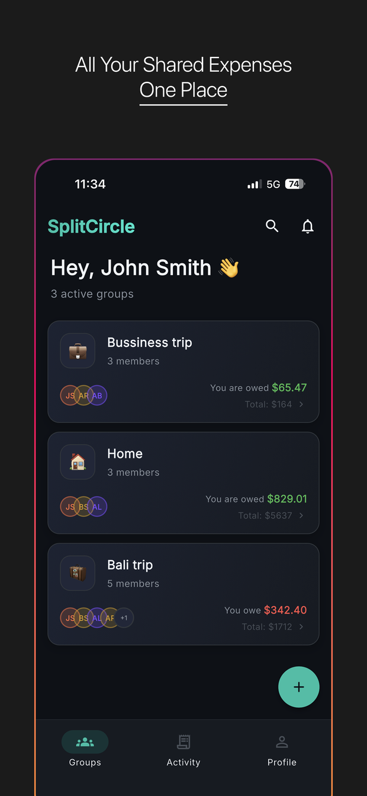
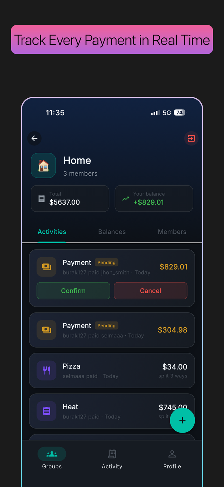
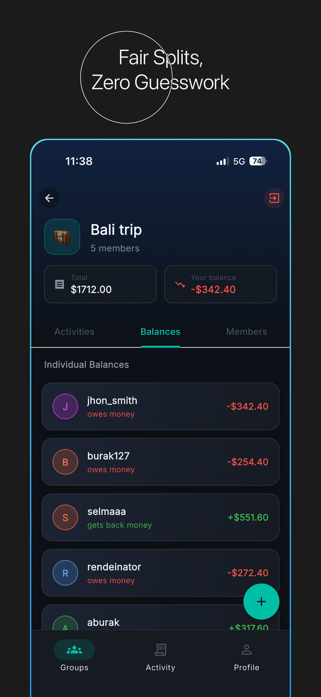

<h1 align="center">Circlio</h1>

<p align="center">
  <strong>Split bills with the people you actually live, travel and eat with.</strong><br>
  A Flutter app for shared expenses — groups, balances and who-owes-who, settled.
</p>

<p align="center">
  
  
  
  
  
</p>

<p align="center">
  <a href="https://apps.apple.com/us/app/circlio-split-bills/id6761620867">App Store</a>
</p>

<p align="center">
  
  
  
</p>

> The app ships under the name **Circlio** on the stores; **SplitCircle** is its
> original name and is still what the code, the bundle identifier and the
> screenshots above use.

Circlio was built, published to the App Store and Play Store, and is now open
source. Everyone in a group adds what they paid; the app keeps a running balance
for each person and works out a short list of payments that settles everyone up.

## What it does

- **Groups for the way people actually share money** — a trip, a house, a couple,
  a family, a workplace. Each carries its own currency and members.
- **Expenses split across whoever was involved** — pick any subset of the group
  and the cost divides equally between them, so the one person who skipped
  dinner does not pay for it.
- **Live balances** — who owes whom, kept up to date as expenses arrive, so
  nobody has to reconcile a spreadsheet at the end of a holiday.
- **Settling up is worked out for you** — debts between each pair are netted off,
  then a greedy pass matches the largest creditor against the largest debtor
  until everyone is square, which keeps the number of transfers down.
- **Payments recorded** — settling up is an entry like any other, so the history
  stays honest.
- **Join by link** — an invite link opens the app straight into the group, via
  iOS Universal Links and Android App Links.
- **Push notifications** — Cloud Functions fire when an expense is added or a
  group changes, so the rest of the group finds out without opening the app.
- **Six languages** — English, Turkish, French, Spanish, Italian and Russian.
- **Sign in with Google or Apple**, with a profile step for display name and
  avatar.

## Architecture

Feature-first: every feature owns its own `data` / `domain` / `presentation`
layers, so a screen, the model behind it and the Firestore access it needs sit
together rather than being scattered across three top-level folders.

```
lib/
├── main.dart                 Firebase bootstrap and app entry
├── app.dart                  Root widget, deep-link handling, locale
├── core/
│   ├── constants/            Group types, default currency
│   ├── theme/                Colour palette and Material theme
│   ├── utils/                Currency and date formatting, l10n extension
│   └── widgets/              Shared UI: glass cards, gradient buttons, avatars
├── features/
│   ├── auth/                 Google/Apple sign-in, profile setup, AppUser
│   ├── groups/               Home, create, join, group detail
│   ├── expenses/             Add expense, add payment, activity model
│   ├── balances/             Who-owes-who calculation
│   ├── activity/             Group activity feed
│   ├── notifications/        FCM registration and handling
│   ├── payments/             In-app purchases
│   ├── profile/              Preferences
│   ├── onboarding/           First-run screens
│   └── splash/               Launch gate
├── routing/                  go_router routes and the tabbed shell
└── l10n/                     Generated localisations, six languages

functions/src/                Cloud Functions: onExpenseCreated, onGroupUpdated
public/                       Firebase Hosting: invite pages, app-link files
```

| Layer | Choice |
| --- | --- |
| State | [Riverpod](https://riverpod.dev) 3 |
| Navigation | [go_router](https://pub.dev/packages/go_router) 17, tabbed shell route |
| Backend | Firebase Auth, Cloud Firestore, Storage, Cloud Messaging |
| Server logic | Cloud Functions for Firebase (TypeScript, Node 22) |
| Auth | Google Sign-In, Sign in with Apple |
| Payments | `in_app_purchase` |
| Deep links | `app_links` + Universal Links / App Links |
| Localisation | `flutter_localizations` + ARB, six locales |

## Getting started

### 1. Prerequisites

| Tool | Version | Notes |
| --- | --- | --- |
| Flutter | **3.41 or newer** | `pubspec.yaml` requires Dart `^3.11.4`, which ships with Flutter 3.41 |
| JDK | **17** | Set in `android/app/build.gradle.kts`; newer JDKs will fail the build |
| Node.js | **22** | Only needed for Cloud Functions |
| Xcode | 15+ | iOS builds only, macOS only |
| Android SDK | via Android Studio | Gradle 8.14 comes with the wrapper |

Check what you have:

```bash
flutter --version    # expect 3.41.x or newer
java -version        # expect 17
```

### 2. Clone and fetch packages

```bash
git clone https://github.com/burakSahinkaya/circlio-split-bills.git
cd circlio-split-bills
flutter pub get
```

### 3. Connect your own Firebase project ← *required*

**The app will not compile until you do this.** Firebase configuration is
deliberately not committed: those files bind the app to one specific Firebase
project, and yours must be your own.

```bash
dart pub global activate flutterfire_cli
npm install -g firebase-tools
firebase login
flutterfire configure
```

`flutterfire configure` creates a project (or picks an existing one) and writes
the three files this repository leaves out:

| File | Platform |
| --- | --- |
| `lib/firebase_options.dart` | all |
| `android/app/google-services.json` | Android |
| `ios/Runner/GoogleService-Info.plist` | iOS |

Then, in the [Firebase console](https://console.firebase.google.com):

1. **Authentication** → enable **Google** and, for iOS, **Apple**.
2. **Firestore Database** → create one.
3. **Storage** → create a bucket (profile photos live here).
4. **Cloud Messaging** → for iOS, upload an APNs key from your Apple Developer
   account.

Two more steps that Google Sign-In will not work without, and which are easy to
miss because the app builds fine without them and only fails at the moment
someone taps *Sign in with Google*:

**Android — register your signing fingerprint.** Google checks that the app
asking to sign in is really yours, by its certificate.

```bash
cd android && ./gradlew signingReport
```

Copy the **SHA-1** from the `debug` variant into Firebase console → *Project
settings* → your Android app → *Add fingerprint*, then download the refreshed
`google-services.json`. Repeat with your release certificate's SHA-1 before you
ship anything.

**iOS — set the URL scheme.** Open your own `ios/Runner/GoogleService-Info.plist`,
copy the `REVERSED_CLIENT_ID` value, and paste it into `ios/Runner/Info.plist`
in place of the `com.googleusercontent.apps.YOUR-REVERSED-CLIENT-ID` placeholder.
Without it, Google Sign-In opens and then has no way back into the app.

> **Security rules are not in this repository.** Firestore starts in a locked or
> wide-open state depending on the mode you choose, and neither is right for
> production. Write rules that let a user read and write only the groups they
> belong to before putting real data in.

### 4. Run it

```bash
flutter run
```

For iOS, open `ios/Runner.xcworkspace` in Xcode first and set **Signing &
Capabilities → Team** to your own Apple developer team — the original team ID
was removed from this repository on purpose. Add the **Sign in with Apple**
capability there too.

<details>
<summary>If the Android build complains about a missing <code>gradlew</code></summary>

Flutter's own `android/.gitignore` excludes `gradlew`, `gradlew.bat` and
`gradle-wrapper.jar`, so they are not in this repository — by design, because
the Flutter tool normally writes them itself on the first build. When it does
not, generate them once:

```bash
cd android
gradle wrapper --gradle-version 8.14
```

Or `flutter clean && flutter pub get` and build again.
</details>

### 5. Cloud Functions (optional)

Push notifications need these deployed; everything else — groups, expenses,
balances, settling up — works without them on Firebase's free Spark plan.

> Deploying functions requires the **Blaze** (pay-as-you-go) plan. It has a free
> monthly allowance that a project this size stays well inside, but it does ask
> for a card. Skip this section entirely if you only want to run the app.

```bash
cd functions
npm install
npm run build
firebase deploy --only functions
```

### 6. Android release signing (optional)

Debug and profile builds need nothing. A release build falls back to the debug
key unless you supply your own, which is fine for testing but cannot be
uploaded to Play.

To sign properly, create `android/key.properties`:

```properties
storePassword=<your store password>
keyPassword=<your key password>
keyAlias=<your key alias>
storeFile=<absolute path to your .jks file>
```

This file and `*.jks` are git-ignored. Keep the keystore backed up somewhere
safe — lose it and you cannot ship an update that Play will accept.

## Forking this for your own app

Beyond the Firebase project, change these:

| What | Where |
| --- | --- |
| Application ID | `android/app/build.gradle.kts`, `namespace` and `applicationId` |
| Bundle identifier | `ios/Runner.xcodeproj`, via Xcode |
| Invite link domain | `_inviteLinkBase` in `lib/features/groups/data/group_service.dart`, and `android:host` in `android/app/src/main/AndroidManifest.xml` |
| Google URL scheme | `CFBundleURLSchemes` in `ios/Runner/Info.plist` |
| Hosting targets | `firebase.json` |
| App-link verification | `public/.well-known/assetlinks.json` (your signing SHA-256) and `apple-app-site-association` (your team ID) |
| In-app purchase IDs | `lib/features/payments/data/iap_service.dart`, and create matching products in App Store Connect / Play Console |
| App name and icons | `pubspec.yaml` (`flutter_launcher_icons`), `assets/images/` |

## Status

Shipped to both stores and no longer under active development. Published here as
a complete, real example of a Flutter + Firebase app: feature-first structure,
Riverpod state, go_router navigation, multi-language support, deep links, push
notifications and in-app purchases, all wired together in a codebase that made
it through review on both platforms.

Issues and pull requests are welcome, but do not expect a fast response.

## License

[MIT](LICENSE).
